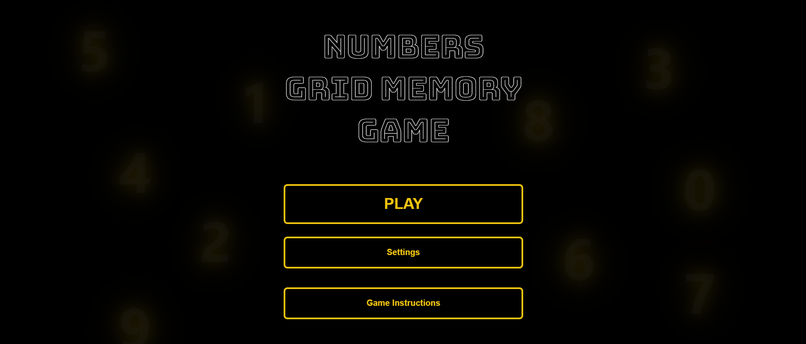
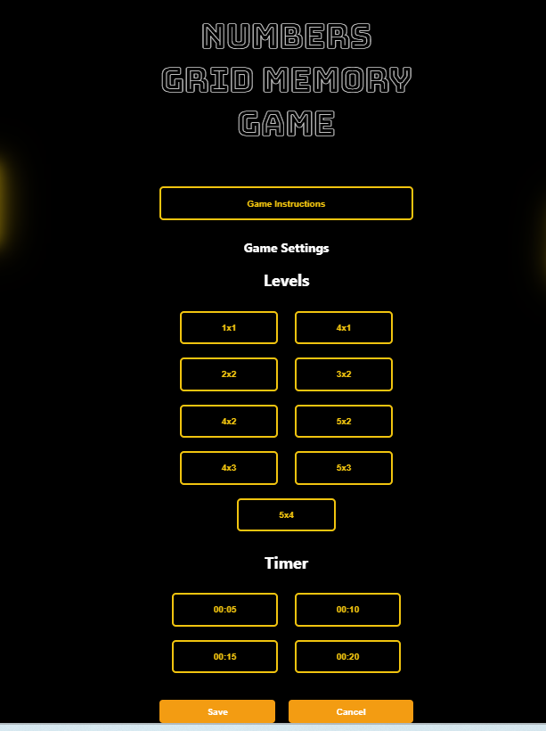
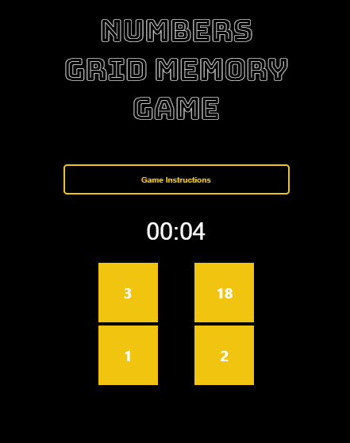
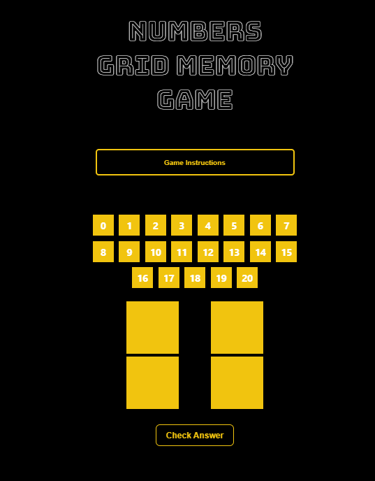

# Grid of Numbers Memory Game

### Welcome to Numbers Grid Memory Game!

[Lets Play!](https://halbuflasa.github.io/GridofNumbersMemoryGame/)

### Objective:
 Remember the numbers in the grid and recall them in the correct order.

###  How to Play:

1. **Select Your Game Settings:**
- Choose a game level
- Adjust the timer options

2. **Start the Game:**
Click the "PLAY" button to begin the game

3. **Memorization Phase:**
Study the grid of numbers displayed in the correct order
You have a limited time to memorize the grid, as indicated by the countdown timer

4. **Recall Phase:**
When the timer expires, try to recall the numbers in the correct order by dragging numbers from a list (0-20)
Fill in the empty grid with the numbers you remember

5. **Check Your Answer:**
Click the "Check My Answer" button to see how well you did
Your correct selections will be highlighted in green
You will receive a clear message indicating whether you won or lost the game

6. **Play Again:**
You can start a new round and re-select your game settings to improve your performance

https://halbuflasa.github.io/GridofNumbersMemoryGame/
Good Luck and Have Fun!

### Attribution:
- I referred to this [Drag and Drop CSS Tricks guide](https://css-tricks.com/creating-a-parking-game-with-the-html-drag-and-drop-api/) when implementing the drag-and-drop functionality.
- The background numbers effect is based on the [CSS Transform guide](https://css-tricks.com/almanac/properties/t/transform/).

### Technologies Used:
- HTML
- CSS
- JavaScript

### Future Enhancements:
I plan to add additional features to the game, such as support for touch screens.

